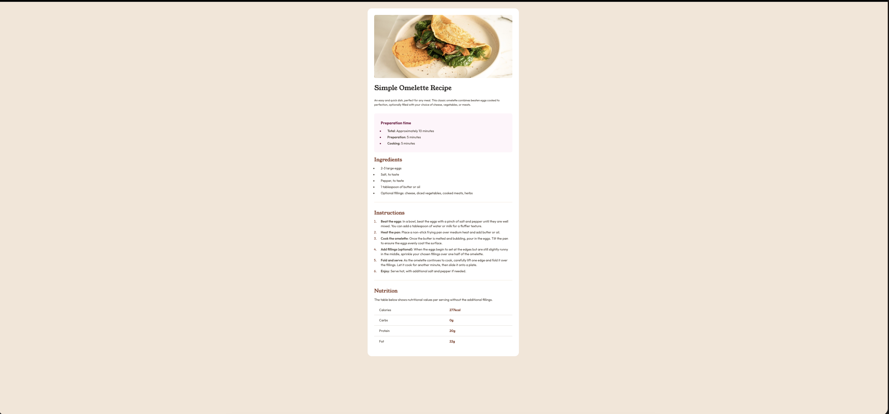

# Frontend Mentor - Recipe page solution

This is a solution to the [Recipe page challenge on Frontend Mentor](https://www.frontendmentor.io/challenges/recipe-page-KiTsR8QQKm). Frontend Mentor challenges help you improve your coding skills by building realistic projects. 

## Table of contents

- [Overview](#overview)
  - [The challenge](#the-challenge)
  - [Screenshot](#screenshot)
  - [Links](#links)
- [My process](#my-process)
  - [Built with](#built-with)
  - [What I learned](#what-i-learned)
- [Author](#author)

## Overview
This challenge was to create a recipe page.

### Screenshot

### Links

- Solution URL: [Solution](https://your-solution-url.com)
- Live Site URL: [Live](https://your-live-site-url.com)

## My process
For this challenge I used flexbox to create the layout along and it also included the use of table and images.

### Built with

- Semantic HTML5 markup
- CSS custom properties
- Flexbox
- Mobile-first workflow

### What I learned
This challenge taught me many things like using
-negative margins to step out of the conatiner padding, 
-captions for table for screen readers

## Author

- Frontend Mentor - [@sagarpb1201](https://www.frontendmentor.io/profile/sagarpb1201)
- Twitter - [@sagarpb1201](https://www.twitter.com/sagarpb1201)
